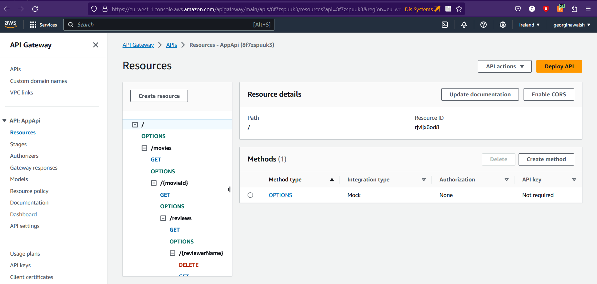
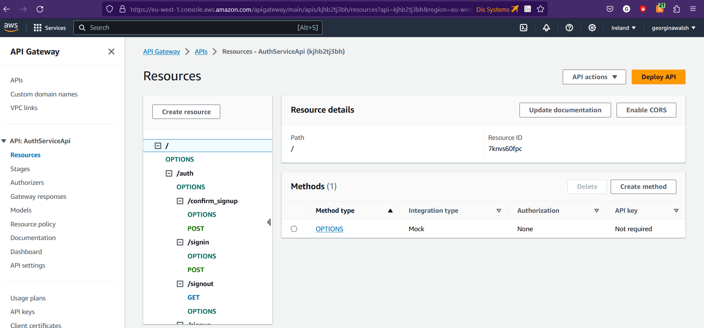
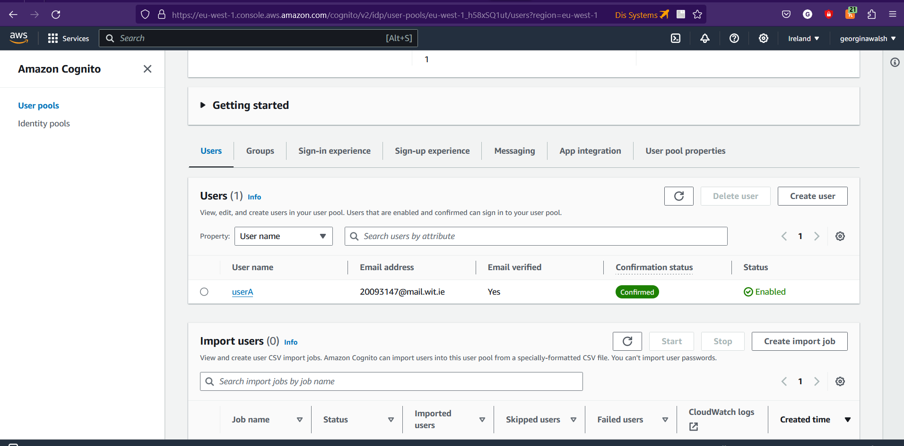

## ServerlessREST Assignment - Distributed Systems.

__Name:__ Georgina Walsh (20093147)

This repository contains the implementation of a serverless REST API for the AWS platform. A CDK stack creates the infrastructure. The domain context of the API is movie reviews.

### API endpoints.
 Post
+ POST /movies/reviews - add a movie review.

Get
+ GET /movies - Get all movie data.
+ GET /movies/{movieId} - Get data regarding a specific movie by its id.
+ GET /movies/{movieId}/reviews - Get all the reviews for a movie with the specified id.
+ GET /movies/{movieId}/reviews?minRating=n - Get all the reviews for the movie with the specified ID with a rating equal to minRating.
+ GET /movies?minRating=n - Get all the reviews for all movies with a rating equal to minRating.
+ GET /movies/{movieId}/reviews/{reviewerName} - Get the review for the movie with the specified movie ID and written by the named reviewer.
+ GET /movies/{movieId}/reviews/{year} - Get the review for the movie with the specified movie ID and written in a certain year.
+ GET /movies/reviews/{reviewerName} - Get reviews from all movies written by a named reviewer.

PUT (Attempted)
+ PUT /movies/{movieId}/reviews/{reviewerName} - Update the content of a  selected review.

### Authentication..

### Independent learning (If relevant)

